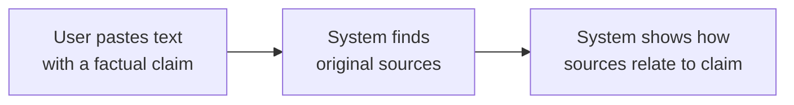
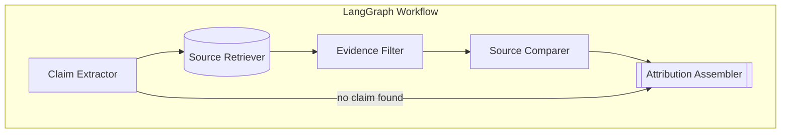

# Chase the Source

A source attribution system that traces factual claims back to their original sources.

Given a piece of text containing a factual claim, Chase the Source will:
1. Extract the factual claim
2. Search for original sources
3. Tell you if the source **directly states**, **paraphrases**, or **contradicts** the claim

---

## Why This Exists

Articles and social posts often contain factual claims that are paraphrased, distorted, or fabricated. Readers can't easily trace claims back to primary sources to verify accuracy.

Chase the Source solves this by automatically finding and comparing original sources against claims.

---

## How It Works



### Attribution Categories

| Result | Meaning |
|--------|---------|
| 🟢 **Direct** | Source states the claim verbatim or near-verbatim |
| 🟡 **Paraphrase** | Source conveys the same meaning in different words |
| 🔴 **Contradiction** | Source states the opposite or conflicts with the claim |
| ⚪ **Not Found** | No sources found that address this specific claim |

---

## Example

**Input:**
> Elon's company absolutely crushed it last year, delivering a whopping 1.8 million vehicles. The stock is going to the moon!

**Output:**

```
EXTRACTED CLAIM: Tesla delivered 1.8 million vehicles in 2023.

ATTRIBUTION: 🟢 DIRECT

SUMMARY: Tesla's official Q4 2023 investor report directly states
delivery of approximately 1.81 million vehicles in 2023.

BEST SOURCE: Tesla Q4 2023 Update (primary)
URL: https://ir.tesla.com/press-release/tesla-q4-2023-update

QUOTE: "In 2023, we produced 1.85 million vehicles and delivered
over 1.8 million vehicles."
```

---

## Quick Start

### Prerequisites

- Python 3.11+
- OpenAI API key ([get one here](https://platform.openai.com))
- Tavily API key ([get one here](https://tavily.com) - free tier available)

### Installation

```bash
# Clone the repository
git clone <repository-url>
cd chase_source

# Create virtual environment
python3.11 -m venv venv
source venv/bin/activate  # Linux/macOS
# OR: venv\Scripts\activate  # Windows

# Install dependencies
pip install -r requirements.txt

# Configure API keys
cp .env.example .env
# Edit .env and add your API keys
```

### Run

```bash
python app.py
```

Open http://localhost:7860 in your browser.

### Docker

```bash
# With docker-compose (recommended)
docker compose up

# Or build manually
docker build -t chase-the-source .
docker run -p 7860:7860 --env-file .env chase-the-source
```

---

## Architecture



### Pipeline Stages

| Stage | Purpose | Technology |
|-------|---------|------------|
| **Claim Extractor** | Extract factual sub-claim from opinionated text | GPT-5-mini |
| **Source Retriever** | Find relevant web sources | Tavily Search API |
| **Evidence Filter** | Filter for relevance, extract quotes | GPT-5-mini |
| **Source Comparer** | Classify: direct/paraphrase/contradiction | GPT-5-mini |
| **Attribution Assembler** | Produce final result with best source | GPT-5-mini |

---

## Source Types

The system classifies sources by reliability:

| Type | Description | Examples |
|------|-------------|----------|
| **Primary** | Original data or direct statements | SEC filings, press releases, official statistics, court documents |
| **Original Reporting** | First-party journalism | Interviews, investigations, on-scene reporting |
| **Secondary** | Aggregation or commentary | Wire rewrites, opinion pieces, blog posts |

Primary sources are prioritized when determining the "best source" for a claim.

---

## Configuration

Environment variables (`.env`):

```bash
# Required
OPENAI_API_KEY=sk-your-key-here
TAVILY_API_KEY=tvly-your-key-here

# Optional
OPENAI_MODEL=gpt-5-mini          # LLM model to use
TAVILY_MAX_RESULTS=10            # Max search results
TAVILY_SEARCH_DEPTH=advanced     # Search depth
LOG_LEVEL=INFO                   # Logging verbosity
GRADIO_SERVER_PORT=7860          # UI port
```

---

## Project Structure

```
chase_source/
├── app.py                      # Gradio UI
├── graph.py                    # LangGraph workflow
├── config.py                   # Settings
├── nodes/
│   ├── claim_extractor.py      # Extract claims from text
│   ├── source_retriever.py     # Search for sources
│   ├── evidence_filter.py      # Filter relevant evidence
│   ├── source_comparer.py      # Classify source-claim relationship
│   └── attribution_assembler.py # Produce final result
├── schemas/
│   └── models.py               # Pydantic data models
├── prompts/
│   └── templates.py            # LLM prompts
├── tests/                      # Test suite
├── docs/                       # Detailed documentation
│   ├── SETUP_GUIDE.md
│   ├── DATA_SCHEMAS.md
│   ├── PROMPTS.md
│   ├── TECHNICAL_SPEC.md
│   └── TESTING_STRATEGY.md
├── requirements.txt
├── Dockerfile
└── docker-compose.yml
```

---

## Testing

```bash
# Run all unit tests
pytest -m unit

# Run with coverage
pytest --cov=nodes --cov=schemas --cov-report=html

# Run specific test
pytest tests/test_claim_extractor.py -v
```

---

## Limitations

- **Single claim**: Extracts and traces one claim at a time
- **No persistence**: Ephemeral, single-session (no saved history)
- **Search dependent**: Quality depends on Tavily search results
- **Temporal gaps**: May find outdated sources for recent claims
- **Language**: English only

---

## Documentation

| Document | Contents |
|----------|----------|
| [SETUP_GUIDE.md](docs/SETUP_GUIDE.md) | Full installation instructions, Docker setup |
| [DATA_SCHEMAS.md](docs/DATA_SCHEMAS.md) | Pydantic models and type definitions |
| [PROMPTS.md](docs/PROMPTS.md) | LLM prompts with few-shot examples |
| [TECHNICAL_SPEC.md](docs/TECHNICAL_SPEC.md) | Implementation details for each node |
| [TESTING_STRATEGY.md](docs/TESTING_STRATEGY.md) | Test fixtures and mocking patterns |

---

## Tech Stack

- **[LangGraph](https://github.com/langchain-ai/langgraph)** - Workflow orchestration
- **[OpenAI API](https://platform.openai.com)** - LLM reasoning (GPT-5-mini)
- **[Tavily](https://tavily.com)** - Web search
- **[Gradio](https://gradio.app)** - Web UI
- **[Pydantic](https://docs.pydantic.dev)** - Data validation

---

## License

MIT
